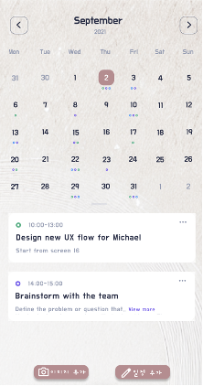
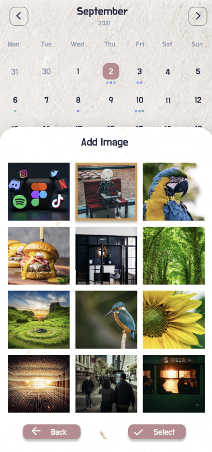

# OCR-NLP

**OCR-NLP**는 이미지에서 텍스트를 추출하고 자연어 처리(NLP)를 활용하여 일정 정보를 생성하는 프로젝트입니다. 이미지 크롤링, OCR(광학 문자 인식), 그리고 KoBART 모델을 사용해 스케줄 제목, 날짜, 시간을 추출하여 구조화된 데이터를 생성합니다.

<table>
  <tr>
    <td style="text-align: center;">
      
    </td>
    <td style="text-align: center;">
      
    </td>
  </tr>
    <td style="text-align: center;">
      <p>앱 이미지 샘플</p>
    </td>
</table>

## 목차
- [프로젝트 개요](#프로젝트-개요)
- [주요 기능](#주요-기능)
- [기술 스택](#기술-스택)
- [설치 방법](#설치-방법)
- [사용 방법](#사용-방법)
- [파일 구조](#파일-구조)
- [기여 방법](#기여-방법)

## 프로젝트 개요
OCR-NLP는 이미지에서 텍스트를 추출하고, 이를 NLP 모델로 분석하여 일정 정보를 자동으로 생성하는 시스템입니다. 이미지 크롤링으로 데이터셋을 수집하고, EasyOCR로 텍스트를 추출하며, KoBART 모델을 통해 스케줄 제목을 생성합니다. 또한 Gemini API를 활용하여 ground truth 데이터셋을 제작합니다. 이 프로젝트는 일정 관리 자동화, 데이터 처리 효율화 등을 목표로 합니다.

1. 이미지 크롤링을 통해서 데이터셋 수집
2. image_organize.py를 활용하여 중복 이미지 처리 및 정렬 
3. Gemini api를 활용하여 이미지에서 schedule title, date, time 정보 추출  truth dataset 제작
4. OCR_NLP.ipynb 내에서  이미지 수신 및 처리 활용 
    easyocr -> text 추출
    koBart  -> schedule title 생성

## 주요 기능
- **이미지 크롤링**: 웹에서 일정 관련 이미지를 수집하여 데이터셋 생성.
- **이미지 전처리**: `image_organize.py`를 사용해 중복 이미지 제거 및 정렬.
- **OCR 처리**: EasyOCR를 활용하여 이미지에서 텍스트(스케줄 제목, 날짜, 시간 등) 추출.
- **NLP 처리**: KoBART 모델로 추출된 텍스트를 분석하여 스케줄 제목 생성.
- **Ground Truth 제작**: Gemini API를 사용해 스케줄 정보의 정확한 데이터셋 생성.
- **데이터 출력**: 추출된 정보를 구조화된 형식(JSON 등)으로 제공.

## 기술 스택
- **프로그래밍 언어**: Python 3.8+
- **라이브러리**:
  - `easyocr`: 이미지에서 텍스트 추출.
  - `transformers`: KoBART 모델을 위한 NLP 처리.
  - `google-generativeai`: Gemini API로 데이터셋 제작.
- **도구**: Jupyter Notebook (`OCR_NLP.ipynb`)

## 설치 방법
1. **필수 요구 사항**:
   - Python 3.8 이상이 설치되어 있어야 합니다.
   - Git이 설치되어 있어야 합니다.

2. **리포지토리 클론**:
   ```bash
   git clone https://github.com/Naljjig/OCR-NLP.git
   cd OCR-NLP
   ```

3. **필수 라이브러리 설치**:
   ```bash
   pip install easyocr transformers google-generativeai
   ```
   - EasyOCR이 GPU를 지원하려면 추가 설정이 필요할 수 있습니다. [EasyOCR 문서](https://github.com/JaidedAI/EasyOCR)를 참고하세요.

4. **Gemini API 설정**:
   - Google Cloud 계정에서 Gemini API 키를 발급받아 환경 변수로 설정:
     ```bash
     export GOOGLE_API_KEY='your-api-key'
     ```
   - 또는 코드 내에서 직접 API 키를 입력.

## 사용 방법
1. **이미지 크롤링**:
   - 웹에서 일정 관련 이미지를 수집하여 `data/` 폴더에 저장합니다.
   - 예: `data/schedule_images/`에 PNG 또는 JPG 파일 저장.

2. **이미지 전처리**:
   - `image_organize.py`를 실행하여 중복 이미지를 제거하고 정렬:
     ```bash
     python image_organize.py --input data/schedule_images --output data/organized_images
     ```

3. **OCR 및 NLP 처리**:
   - `OCR_NLP.ipynb`를 Jupyter Notebook에서 실행:
     ```bash
     jupyter notebook OCR_NLP.ipynb
     ```
   - 노트북 내에서 다음 단계를 수행:
     - EasyOCR로 이미지에서 텍스트 추출.
     - KoBART 모델로 스케줄 제목 생성.
     - Gemini API로 ground truth 데이터셋 생성.

4. **결과 확인**:
   - 처리된 데이터는 JSON 또는 CSV 형식으로 `output/` 폴더에 저장됩니다.
   - 예: `output/schedule_data.json`

## 파일 구조
```
OCR-NLP/
├── data/                   # 크롤링된 이미지 데이터
├── output/                 # 처리된 결과물 (JSON, CSV 등)
├── image_organize.py       # 이미지 전처리 스크립트
├── OCR_NLP.ipynb           # OCR 및 NLP 처리 노트북
├── README.md               # 프로젝트 설명
└── requirements.txt        # 의존성 목록 (생성 필요 시)
```

## 기여 방법
이 프로젝트에 기여하고 싶다면 다음 단계를 따라주세요:
1. 리포지토리를 포크합니다.
2. 새로운 브랜치를 생성합니다: `git checkout -b feature/YourFeature`.
3. 변경 사항을 커밋합니다: `git commit -m 'Add your feature'`.
4. 푸시 후 풀 리퀘스트를 생성합니다: `git push origin feature/YourFeature`.

버그 리포트나 기능 제안은 [Issues](https://github.com/Naljjig/OCR-NLP/issues) 페이지에서 작성해 주세요.

## 라이선스
이 프로젝트는 [MIT 라이선스](LICENSE)를 따릅니다. 자세한 내용은 LICENSE 파일을 참조하세요.
